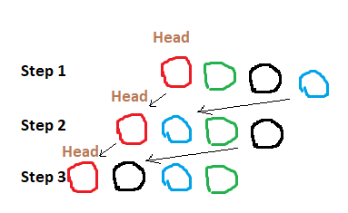
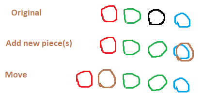
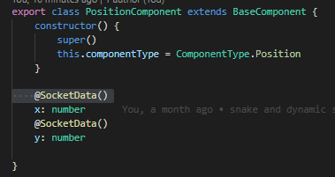
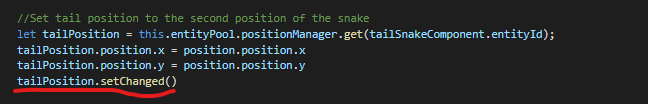
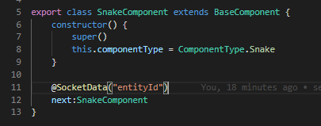

# SnakticsBackend

## To start the application:
 - Download node: https://nodejs.org/en/download/
 - run `npm i` to install dependencied in the root folder of the project
 - run `npm start` it will start nodemoon which restart the server every time a file is changed
## Run tests
 - run `npm test`it will run every tests followwing the naming convention: `tests/**/**-test.ts`
 
## Moving snake

## Growing snake

## Sending component data to client
 - Mark the properties of the component with `SocketData()` decorator  
 
 - Set the component status to changed whenever you change the tracked properties of the component (TODO it can be done automaticly with a custom setter)  
 
 - If you need only one ore more sub-property of the property you can specify them by passing the sub-property name in parameter:
 (you can use more decorators on the same property)  
 
